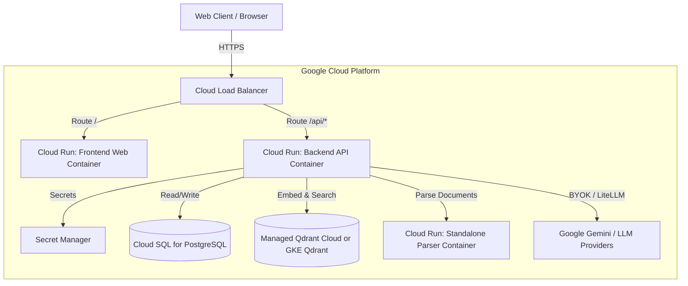

# Brass Tacks: Illustrative Cloud Deployment Plan

This document details an *illustrative, unbuilt* cloud deployment topology for Brass Tacks to demonstrate architectural foresight for hosting the engine in a production cloud environment.

> [!NOTE]
> Brass Tacks is designed and maintained as a local-first, single-user desktop engine (default run environment). The deployment path sketched here is for design demonstration and is not built or actively maintained in the codebase.

## Conceptual Architecture

For a secure, resilient, and scalable production deployment on a cloud provider like Google Cloud Platform (GCP), the local multi-service container orchestration is mapped to managed services:

## Cloud Service Mapping

| Local Component | Cloud Managed Service | Rationale |
|---|---|---|
| **Next.js Web (Port 3000)** | Google Cloud Run | Serverless container hosting, auto-scaling to zero when idle to minimize costs. |
| **FastAPI Gateway (Port 8000)** | Google Cloud Run | Serverless API runtime, handles JWT auth, retrieval, and streaming SSE responses. |
| **PostgreSQL (Port 5432)** | Cloud SQL for PostgreSQL | Managed relational database. Provides automated backups, high availability, and encryption at rest. |
| **Qdrant Vector DB (Port 6333)** | Qdrant Cloud (SaaS) or GKE | Managed vector database or self-hosted stateful service in Google Kubernetes Engine (GKE) for low-latency semantic search. |
| **Docling Parser (Port 8081)** | Google Cloud Run | The document parsing service is run as a separate serverless microservice to isolate CPU-intensive PDF/DOCX processing. |
| **Secrets (.env)** | Google Secret Manager | Securely stores sensitive credentials like the database passwords and system Gemini API keys, injected into Cloud Run at runtime. |

## Production Security Considerations

1. **Private Networking:** All backend components (Cloud SQL, Qdrant, Parser) are placed inside a private VPC. Backend Cloud Run services connect via serverless VPC connectors, and database/vector stores publish only to private IP addresses.
2. **Access Control:** User authentication remains JWT-based, and API keys are held transiently in memory or retrieved from Secret Manager.
3. **Data Residency:** All databases run in the local region specified by the deployment context to ensure minimal latency and strict compliance with local data protection regulations.
